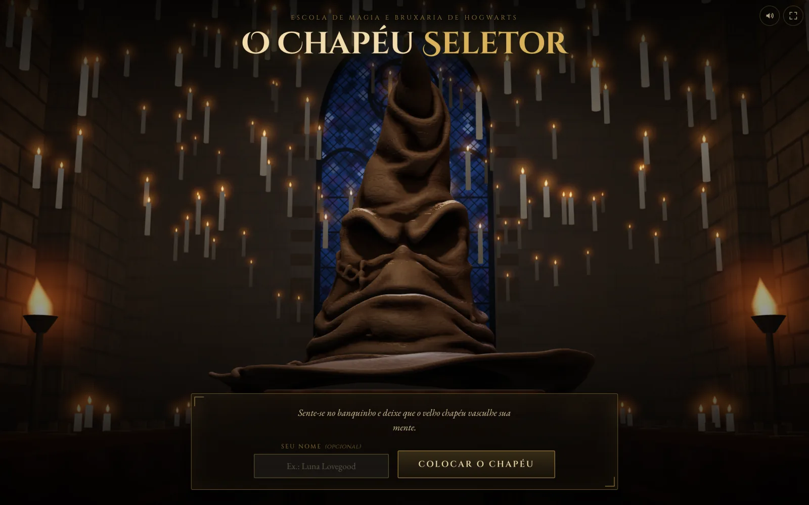
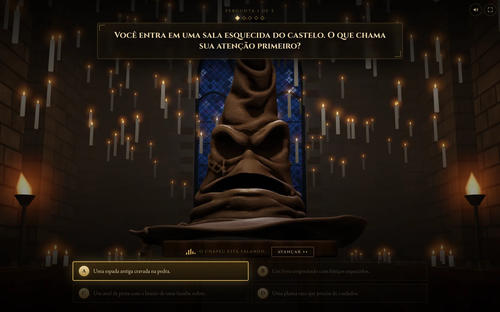
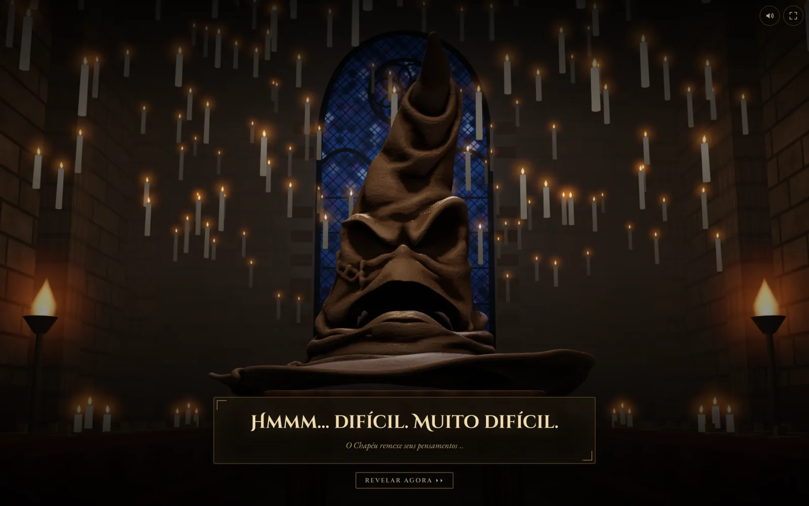
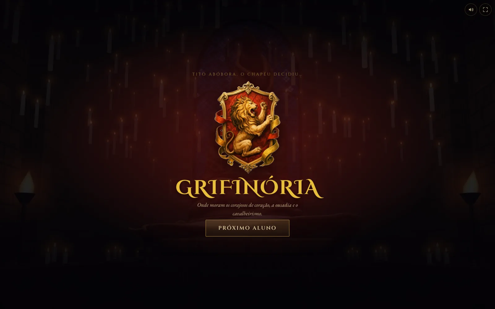

# O Chapéu Seletor

Um teste de casas de Hogwarts no navegador, com o Chapéu Seletor em 3D. A pessoa
responde 5 perguntas, o Chapéu comenta cada resposta com a própria voz e, no fim,
anuncia a casa.



## O que é e por que existe

Foi feito para uma festa de aniversário com tema de Harry Potter. A ideia era que
os convidados pudessem descobrir com facilidade a qual casa pertencem: um teste
rápido, interativo e divertido, que roda num computador ou numa TV, sem cadastro e
sem internet além das fontes.

## Como funciona

1. **Início.** A pessoa digita o nome (opcional) e clica em "Colocar o Chapéu".
2. **5 perguntas**, cada uma com 4 alternativas. Cada alternativa pertence a uma
   casa e vale 1 ponto para ela. A ordem das alternativas é embaralhada a cada
   partida, para que a mesma letra não leve sempre à mesma casa.
3. **Reação do Chapéu.** Depois de cada resposta, toca a fala do Chapéu para aquela
   alternativa (são 20 falas, uma por alternativa). A tela fica travada enquanto ele
   fala e só passa para a próxima pergunta quando o áudio termina. Depois de 1,6 s
   aparece o botão "Avançar" para pular a fala.
4. **Apuração**, em `apurar()` no `src/data/houses.ts`: acha a maior pontuação
   entre as 4 casas e junta todas as que chegaram a ela.

   Com 5 perguntas o empate no topo é raro, mas acontece (2-2-1-0, por exemplo).
   No empate o Chapéu não sorteia: como nos livros, ele leva em conta a escolha da
   pessoa. Uma tela pergunta qual das casas empatadas ela prefere, e a escolhida
   segue para o veredito. A tela de resultado lembra entre quais casas ela estava.
5. **Suspense.** O Chapéu "pensa" na tela de suspense enquanto toca a fala do
   veredito da casa escolhida. A revelação espera o fim dessa fala e dura no mínimo
   2,8 s. O botão "Revelar agora" aparece depois de 1,6 s.
6. **Veredito.** O cenário escurece e aparecem o brasão, o nome e o lema da casa.
   "Próximo Aluno" volta ao início para o próximo convidado.

Se um MP3 faltar ou o navegador bloquear o som, o fluxo não trava: depois de um
erro ele espera um tempo fixo e segue, e um áudio parado sem nenhum evento é
destravado em 15 s.



## O Chapéu em 3D e as expressões

- **Modelo.** A malha do Chapéu foi gerada com o [Meshy](https://www.meshy.ai/) e
  depois preparada para a web (limpeza, normais suaves, compressão meshopt e um
  atributo de superfície assado). Fica em `public/models/chapeu.glb`.
- **Material.** O modelo não tem textura. O couro é procedural, calculado no shader
  a partir da geometria (vincos escuros, cristas mais claras, grão e arranhões em
  ruído 3D).
- **Rosto no vertex shader.** A malha é uma só e parada. Lábios, cantos da boca,
  sobrancelhas, olhos, nariz e ponta são regiões suaves no espaço do modelo, e o
  shader deforma cada uma por uniforms. A normal é recalculada por diferença
  finita, então a luz acompanha a careta.
- **Expressões por momento.** Cada expressão é um conjunto de valores para essas
  regiões, e cada valor chega ao alvo por uma mola amortecida, sem saltos:
  - início e perguntas: neutro, com piscadas e a ponta balançando devagar;
  - reação a uma resposta: a expressão muda conforme a casa da alternativa
    (satisfeito para Grifinória e Lufa-Lufa, surpreso para Corvinal, desconfiado
    para Sonserina);
  - suspense: pensativo, com a ponta enrolando para os lados; no fim da fala do
    veredito ele passa a triunfante;
  - resultado: triunfante.
- **Boca sincronizada com a voz.** O áudio da fala passa por um `AnalyserNode` da
  Web Audio API, com filtro na faixa da voz. O volume de cada quadro abre e fecha a
  boca, e o começo de cada sílaba dá um pequeno tranco nas sobrancelhas e na ponta.
  Sem análise de áudio disponível, a boca segue um ritmo de sílabas gerado no
  código.
- **Salão Principal.** A cena é montada em código com three.js: paredes, vitral,
  banco, velas flutuantes e tochas. As chamas são desenhadas num único shader
  instanciado, e as texturas são geradas no carregamento.
- **Desempenho e alternativas.** O pedaço 3D é carregado depois da interface. Se a
  máquina ficar abaixo de cerca de 40 fps, a resolução do canvas baixa. Sem WebGL 2,
  com "reduzir movimento" ligado no sistema ou se o modelo falhar, aparece uma
  imagem parada da própria cena (`public/cena/`).



## Controles

| Controle | O que faz |
|---|---|
| Botão de alto-falante (canto superior direito) | Silencia as falas. O fluxo e a boca continuam iguais, só sem som. A escolha fica salva no navegador. |
| Botão de tela cheia, ou tecla **F** | Entra e sai da tela cheia. O botão não aparece onde o navegador não permite (no iPhone, por exemplo). |
| Teclas **1** a **4** ou **A** a **D** | Respondem a pergunta pelo teclado. |
| "Avançar" e "Revelar agora" | Pulam a fala em curso. |
| "Próximo Aluno" | Zera tudo e volta ao início. |

## Stack

- TypeScript e React 18
- three.js e React Three Fiber
- GLSL (deformação do rosto, couro e chamas)
- Web Audio API (análise do volume da fala)
- Vite
- CSS próprio, num único `src/styles.css`, sem framework de estilo

## Como rodar

Requer Node.js e npm.

```bash
npm install
npm run dev
```

O Vite abre o navegador e mostra no terminal o endereço local e o da rede, para
abrir também pelo celular no mesmo Wi-Fi.

| Script | O que faz |
|---|---|
| `npm run dev` | Servidor de desenvolvimento. |
| `npm run typecheck` | Só a checagem de tipos (`tsc --noEmit`). |
| `npm run build` | Checagem de tipos e build em `dist/`. Falha se houver erro de tipo. |
| `npm run preview` | Serve a pasta `dist/` para usar ou conferir o build. |

### Build para usar na festa

```bash
npm run build
npm run preview
```

O `dist/` precisa ser servido por HTTP. Abrir o `dist/index.html` com dois cliques
não funciona no Chrome e nos navegadores baseados nele: os scripts do build são
bloqueados em `file://` e a página fica em branco. Além do `npm run preview`,
qualquer servidor estático serve, por exemplo:

```bash
python3 -m http.server 8080 -d dist
```

As fontes vêm do Google Fonts. Sem internet, a interface usa as fontes serifadas do
sistema.

## Estrutura

```
chapeu-seletor/
├─ index.html
├─ vite.config.ts
├─ tsconfig.json
├─ LICENSE
├─ docs/screenshots/           capturas usadas neste README
├─ public/
│  ├─ audio/                   24 MP3: 20 reações e 4 vereditos
│  ├─ models/chapeu.glb        o Chapéu em 3D
│  ├─ cena/                    imagens paradas da cena, para quando o 3D não roda
│  ├─ brasoes/                 PNG dos brasões das casas
│  └─ video/                   vídeos da versão anterior, fora de uso
└─ src/
   ├─ main.tsx                 ponto de entrada
   ├─ App.tsx                  fluxo das telas e estado
   ├─ types.ts                 HouseKey, Question, Placar, Veredito
   ├─ config.ts                tempos e caminhos
   ├─ styles.css
   ├─ data/
   │  ├─ questions.ts          as 5 perguntas, com casa e áudio de cada alternativa
   │  └─ houses.ts             as casas, a apuração e o desempate
   ├─ hooks/
   │  ├─ useHatAudio.ts        toca as falas, analisa o volume e controla o som
   │  └─ useTelaCheia.ts       tela cheia, inclusive no Safari
   ├─ cena/
   │  ├─ Cenario.tsx           fundo: imagem parada e cena 3D carregada sob demanda
   │  ├─ CenaChapeu.tsx        canvas, câmera, luzes e névoa
   │  ├─ Salao.tsx             o Salão Principal
   │  ├─ Chamas.tsx            velas e tochas num shader instanciado
   │  ├─ texturas.ts           texturas procedurais
   │  └─ chapeu/
   │     ├─ Chapeu.tsx         o Chapéu na cena
   │     ├─ modelo.ts          carrega o glb
   │     ├─ couro.ts           material de couro
   │     ├─ deformacao.ts      deformação do rosto no vertex shader
   │     └─ expressoes.ts      expressões, molas e boca
   └─ components/
      ├─ StartScreen.tsx
      ├─ QuestionScreen.tsx
      ├─ SuspenseScreen.tsx
      ├─ ResultScreen.tsx
      ├─ HouseCrest.tsx        brasão: o PNG, ou um escudo desenhado em SVG
      └─ ControlesTela.tsx     botões de som e tela cheia
```

Para acrescentar uma pergunta, basta incluir um objeto em `QUESTIONS`, com as 4
alternativas, a casa e o áudio de cada uma. O contador e a apuração se ajustam
sozinhos.



## Créditos e aviso legal

### Créditos

- **Modelo 3D do Chapéu:** Modelo 3D gerado com Meshy AI ([meshy.ai](https://www.meshy.ai/)).
  As gerações do plano gratuito do Meshy são distribuídas sob a licença
  [Creative Commons Atribuição 4.0 (CC BY 4.0)](https://creativecommons.org/licenses/by/4.0/deed.pt-br),
  e o modelo segue esses termos. O arquivo deste repositório é uma versão
  modificada da geração original: malha limpa, normais suavizadas, compressão
  meshopt e um atributo de superfície acrescentado para o shader.
- **Cena 3D, animação, expressões e código:** desenvolvidos por Pedro Toni com o
  Claude (Anthropic).
- **Vozes do Chapéu:** geradas com o [fish.audio](https://fish.audio/), sujeitas aos
  termos de uso do serviço.

### Aviso legal

Este é um projeto de fã, não oficial e sem fins comerciais, feito para uma festa de
aniversário particular e para estudo. Não tem vínculo com a Warner Bros.
Entertainment, a Wizarding World Digital ou J.K. Rowling, e não é endossado nem
patrocinado por elas.

Harry Potter, o Chapéu Seletor, Hogwarts, os nomes das casas (Grifinória, Sonserina,
Corvinal e Lufa-Lufa) e os seus brasões são marcas e obras protegidas dos seus
respectivos titulares. Aparecem aqui sem fins comerciais, e nenhum direito sobre
eles é reivindicado.

As imagens em `public/brasoes/` são ilustrações dos brasões das quatro casas. O
repositório não registra quem as criou nem de onde vieram: elas entraram no
primeiro commit sem indicação de fonte. Por retratarem os brasões das casas, valem
para elas as mesmas ressalvas acima, e elas não são cobertas pela licença deste
repositório.

Se algum titular de direitos pedir, o material será removido.

### Licença

O código-fonte escrito para este projeto está sob a licença MIT (ver
[`LICENSE`](LICENSE)). A licença cobre só esse código. Ficam de fora as marcas,
personagens, nomes e brasões de terceiros, o modelo 3D gerado com o Meshy (que
segue a CC BY 4.0) e as vozes geradas com o fish.audio (sujeitas aos termos do
serviço).
